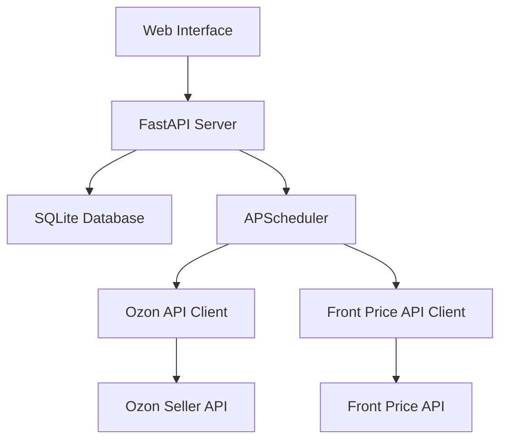

# Техническая спецификация API Ozon Price Updater 3.0

## 1. Общая архитектура системы

### 1.1 Компоненты системы
```
├── API Server (FastAPI)
├── База данных (SQLite)
├── Планировщик задач (APScheduler)
├── Клиентские API
│   ├── Ozon Seller API
│   └── Front Price API
└── Веб-интерфейс
```

### 1.2 Схема взаимодействия


## 2. API Endpoints

### 2.1 Управление товарами

#### 2.1.1 Получение списка товаров
```http
GET /api/products

Query Parameters:
- page: int (default: 1)
- per_page: int (default: 50)
- active: bool
- has_stock: bool
- search: string

Response: 200 OK
{
    "items": [
        {
            "id": int,
            "product_id": string,
            "sku": string,
            "name": string,
            "product_url": string,
            "marketing_price": float,
            "min_price": float,
            "old_price": float,
            "price": float,
            "front_price": float,
            "mrpc": float,
            "available": bool,
            "active": bool,
            "front_price_timestamp": datetime,
            "update_timestamp": datetime
        }
    ],
    "total": int,
    "page": int,
    "pages": int
}
```

#### 2.1.2 Ручное получение данных о товарах
```http
GET /api/products/fetch

Response: 200 OK
{
    "status": "success",
    "fetched": int,
    "updated": int,
    "errors": [
        {
            "product_id": string,
            "error": string
        }
    ]
}
```

#### 2.1.3 Ручное получение цен с витрины
```http
POST /api/products/fetch-prices

Request:
{
    "product_ids": [string]  // опционально
}

Response: 200 OK
{
    "status": "success",
    "fetched": int,
    "updated": int,
    "errors": [
        {
            "product_id": string,
            "error": string
        }
    ]
}
```

#### 2.1.4 Установка МРЦ для товаров
```http
POST /api/products/set-mrpc

Request:
{
    "items": [
        {
            "sku": string,
            "mrpc": float
        }
    ]
}

Response: 200 OK
{
    "status": "success",
    "updated": [
        {
            "sku": string,
            "mrpc": float,
            "message": string
        }
    ],
    "errors": [
        {
            "sku": string,
            "error": string
        }
    ]
}
```

#### 2.1.5 Установка скидок для товаров
```http
POST /api/products/set-discount

Request:
{
    "items": [
        {
            "sku": string,
            "discount": float  // процент скидки
        }
    ]
}

Response: 200 OK
{
    "status": "success",
    "updated": [
        {
            "sku": string,
            "discount": float,
            "old_price": float,
            "message": string
        }
    ],
    "errors": [
        {
            "sku": string,
            "error": string
        }
    ]
}
```

#### 2.1.6 Управление активностью товара
```http
POST /api/products/{product_id}/activate

Response: 200 OK
{
    "status": "success",
    "product_id": string,
    "active": true,
    "message": string
}

POST /api/products/{product_id}/deactivate

Response: 200 OK
{
    "status": "success",
    "product_id": string,
    "active": false,
    "message": string
}
```

#### 2.1.7 Обновление параметров товара
```http
PUT /api/products/{product_id}

Request:
{
    "mrpc": float,
    "active": bool
}

Response: 200 OK
{
    "status": "success",
    "message": "Product updated successfully"
}
```

#### 2.1.8 Принудительное обновление цен
```http
POST /api/products/update-prices

Request:
{
    "product_ids": [string]  // опционально
}

Response: 200 OK
{
    "status": "success",
    "updated": int,
    "errors": [
        {
            "product_id": string,
            "error": string
        }
    ]
}
```

### 2.2 Мониторинг и статистика

#### 2.2.1 История изменения цен
```http
GET /api/price-history

Query Parameters:
- product_id: string
- start_date: date
- end_date: date
- page: int
- per_page: int

Response: 200 OK
{
    "items": [
        {
            "id": int,
            "product_id": string,
            "timestamp": datetime,
            "showcase_price": float,
            "old_price": float,
            "new_price": float
        }
    ],
    "total": int,
    "page": int,
    "pages": int
}
```

#### 2.2.2 Журнал API-запросов
```http
GET /api/api-logs

Query Parameters:
- start_date: date
- end_date: date
- status: string
- page: int
- per_page: int

Response: 200 OK
{
    "items": [
        {
            "id": int,
            "timestamp": datetime,
            "endpoint": string,
            "method": string,
            "status_code": int,
            "response_time": float,
            "products_count": int,
            "success": bool,
            "error_message": string,
            "request_payload": string,  // JSON строка
            "response_payload": string  // JSON строка
        }
    ],
    "total": int,
    "page": int,
    "pages": int
}
```

### 2.3 Настройки системы

#### 2.3.1 Получение настроек
```http
GET /api/settings

Response: 200 OK
{
    "monitoring_interval": int,
    "price_update_interval": int,
    "ozon_client_id": string,
    "ozon_api_key": string,
    "front_price_api_url": string,
    "secret_key": string,
    "last_update": datetime,
    "next_update": datetime
}
```

#### 2.3.2 Обновление настроек
```http
PUT /api/settings

Request:
{
    "monitoring_interval": int,
    "price_update_interval": int,
    "front_price_api_url": string,
    "ozon_client_id": string,
    "ozon_api_key": string
}

Response: 200 OK
{
    "status": "success",
    "message": "Settings updated successfully"
}
```

#### 2.3.3 Генерация нового секретного ключа
```http
POST /api/settings/generate-secret

Response: 200 OK
{
    "status": "success",
    "secret_key": string
}
```

## 3. Модели базы данных

### 3.1 SkuMonitoring
```sql
CREATE TABLE sku_monitoring (
    id INTEGER PRIMARY KEY AUTOINCREMENT,
    product_id TEXT NOT NULL,
    sku TEXT NOT NULL,
    name TEXT NOT NULL,
    product_url TEXT,
    marketing_price REAL,
    min_price REAL,
    old_price REAL,
    price REAL NOT NULL,
    front_price REAL,
    mrpc REAL,
    discount REAL DEFAULT 0.0,  // Процент скидки от 0 до 100
    available BOOLEAN DEFAULT TRUE,
    active BOOLEAN DEFAULT FALSE,
    front_price_timestamp DATETIME,
    update_timestamp DATETIME,
    UNIQUE(product_id)
);

CREATE INDEX idx_sku_monitoring_sku ON sku_monitoring(sku);
CREATE INDEX idx_sku_monitoring_active ON sku_monitoring(active);
```

### 3.2 PriceHistory
```sql
CREATE TABLE price_history (
    id INTEGER PRIMARY KEY AUTOINCREMENT,
    product_id TEXT NOT NULL,
    timestamp DATETIME NOT NULL,
    showcase_price REAL,
    old_price REAL,
    new_price REAL,
    FOREIGN KEY (product_id) REFERENCES sku_monitoring(product_id)
);

CREATE INDEX idx_price_history_product ON price_history(product_id);
CREATE INDEX idx_price_history_timestamp ON price_history(timestamp);
```

### 3.3 ApiLogEntry
```sql
CREATE TABLE api_log_entry (
    id INTEGER PRIMARY KEY AUTOINCREMENT,
    timestamp DATETIME NOT NULL,
    endpoint TEXT NOT NULL,
    method TEXT NOT NULL,
    status_code INTEGER,
    response_time REAL,
    products_count INTEGER,
    success BOOLEAN,
    error_message TEXT,
    request_payload TEXT,
    response_payload TEXT
);

CREATE INDEX idx_api_log_timestamp ON api_log_entry(timestamp);
CREATE INDEX idx_api_log_success ON api_log_entry(success);
```

## 4. Планировщик задач

### 4.1 Конфигурация задач
```python
{
    "maintain_mrpc_prices": {
        "func": "tasks.maintain_mrpc_prices",
        "trigger": "interval",
        "minutes": settings.PRICE_UPDATE_INTERVAL,
        "max_instances": 1
    },
    "monitor_products": {
        "func": "tasks.monitor_products",
        "trigger": "interval",
        "minutes": settings.MONITORING_INTERVAL,
        "max_instances": 1
    },
    "verify_price_changes": {
        "func": "tasks.verify_price_changes",
        "trigger": "interval",
        "minutes": 1,
        "max_instances": 1
    }
}
```

### 4.2 Основные задачи

#### 4.2.1 Мониторинг товаров (monitor_products)
```python
async def monitor_products():
    """
    Задача мониторинга всех товаров продавца
    
    Процесс:
    1. Получение полного списка товаров из Ozon API
    2. Для каждого товара:
       - Обновление базовой информации (наличие, цены, статусы)
       - Получение цены с витрины
       - Проверка наличия МРЦ
       - Расчет отклонений от МРЦ (если задано)
       - Обновление информации о доступности:
         * available = True если товар есть в наличии
    3. Сохранение изменений в базе данных
    4. Логирование результатов мониторинга
    """
```

#### 4.2.2 Поддержание цен МРЦ (maintain_mrpc_prices)
```python
async def maintain_mrpc_prices():
    """
    Задача поддержания цен в соответствии с МРЦ и скидками
    
    Процесс:
    1. Получение списка товаров с заданным МРЦ
    2. Для каждого товара:
       - Проверка текущей цены на витрине
       - Сравнение с установленным МРЦ
       - Расчет отклонений
       - Если товар активен (active = True):
         * Расчет новой цены
         * Расчет old_price с учетом скидки (если задана)
         * Отправка запроса на изменение цены в Ozon API
         * Добавление в очередь на проверку изменения
         * Сохранение в истории изменений
    3. Логирование результатов обновления цен
    """
```

#### 4.2.3 Проверка изменения цен (verify_price_changes)
```python
async def verify_price_changes():
    """
    Проверка применения изменений цен
    
    Процесс:
    1. Получение списка товаров из очереди на проверку
    2. Для каждого товара:
       - Получение актуальной цены с витрины
       - Сравнение с ожидаемой ценой
       - Если цена не изменилась:
         * Отправка уведомления
         * Логирование ошибки
    3. Очистка проверенных товаров из очереди
    """
```

### 4.3 Логика активации товаров

```python
def can_activate_product(product: Product) -> tuple[bool, str]:
    """
    Проверка возможности активации товара
    
    Args:
        product: Модель товара
        
    Returns:
        tuple[can_activate: bool, message: str]
        
    Логика:
    1. Товар можно активировать если:
       - Есть в наличии (available = True)
       - Установлено МРЦ (mrpc > 0)
       - Есть цена на витрине (front_price > 0)
    2. В противном случае возвращается False и причина
    """
    if not product.available:
        return False, "Товар не доступен"
    if not product.mrpc or product.mrpc <= 0:
        return False, "Не установлено МРЦ"
    if not product.front_price or product.front_price <= 0:
        return False, "Нет цены на витрине"
    return True, "Товар можно активировать"
```

### 4.4 Расчет цен для товаров

```python
def calculate_price_adjustment(
    current_price: float,
    front_price: float,
    mrpc: float,
    discount: float = 0.0
) -> tuple[float, float]:
    """
    Расчет новой цены и старой цены для управления скидкой
    
    Args:
        current_price: Текущая цена товара
        front_price: Цена на витрине
        mrpc: Минимальная розничная цена (фиксированная)
        discount: Процент скидки (0-100)
    
    Returns:
        tuple[new_price, new_old_price]
        
    Логика:
    1. МРЦ является фиксированной ценой, которую мы хотим получить на витрине
    2. Управление скидкой происходит через old_price:
       - price = МРЦ (всегда фиксирована)
       - old_price = МРЦ / (1 - discount/100)
    
    Пример:
    - МРЦ = 2000 рублей (фиксированная)
    - Хотим скидку 30%:
      * price = 2000
      * old_price = 2000 / (1 - 0.3) = 2857
    - Хотим увеличить скидку до 40%:
      * price = 2000 (не меняется)
      * old_price = 2000 / (1 - 0.4) = 3333
    
    Таким образом мы управляем размером скидки через old_price,
    всегда поддерживая нужную конечную цену (МРЦ) на витрине.
    """
    if not mrpc or mrpc <= 0:
        return current_price, current_price
        
    # Всегда используем МРЦ как целевую цену
    new_price = mrpc
    
    # Если задана скидка, рассчитываем old_price для получения нужного процента скидки
    if discount > 0 and discount < 100:
        new_old_price = round(mrpc / (1 - discount / 100))
        return new_price, new_old_price
            
    return new_price, new_price
```

## 5. Интеграция с внешними API

### 5.1 Ozon Seller API
```python
class OzonApi:
    def __init__(self, client_id: str, api_key: str):
        self.base_url = "https://api-seller.ozon.ru"
        self.headers = {
            "Client-Id": client_id,
            "Api-Key": api_key,
            "Content-Type": "application/json"
        }
    
    async def get_product_list(self) -> List[Dict]:
        """Получение списка товаров"""
        
    async def get_product_info(self, product_ids: List[str]) -> List[Dict]:
        """Получение информации о товарах"""
        
    async def set_product_prices(self, prices: List[Dict]) -> Dict:
        """Обновление цен товаров"""
```

### 5.2 Front Price API
```python
class FrontPriceApi:
    def __init__(self, base_url: str):
        self.base_url = base_url
    
    async def get_prices(self, seller_id: str, page: int = 1) -> Dict:
        """Получение цен с витрины"""
```

## 6. Обработка ошибок

### 6.1 Коды ошибок
```python
class APIError(Exception):
    def __init__(self, code: int, message: str):
        self.code = code
        self.message = message

class ErrorCodes:
    PRODUCT_NOT_FOUND = 404
    INVALID_PRICE = 400
    API_ERROR = 500
    RATE_LIMIT = 429
```

### 6.2 Middleware для логирования
```python
@app.middleware("http")
async def log_requests(request: Request, call_next):
    start_time = time.time()
    response = await call_next(request)
    
    await db.api_log_entry.create(
        endpoint=request.url.path,
        method=request.method,
        status_code=response.status_code,
        response_time=time.time() - start_time,
        success=response.status_code < 400
    )
    
    return response
```

## 7. Безопасность

### 7.1 Конфигурация
```python
class Settings(BaseSettings):
    OZON_CLIENT_ID: str
    OZON_API_KEY: str
    FRONT_PRICE_API_URL: str
    DATABASE_URL: str = "sqlite:///app.db"
    
    class Config:
        env_file = ".env"
```

### 7.2 Rate Limiting
```python
limiter = Limiter(key_func=get_remote_address)

@app.on_event("startup")
async def startup():
    redis = aioredis.from_url("redis://localhost")
    FastAPILimiter.init(redis)

@app.get("/api/products")
@limiter.limit("100/minute")
async def get_products():
    ...
```

## 8. Мониторинг и метрики

### 8.1 Prometheus метрики
```python
from prometheus_client import Counter, Histogram

REQUEST_COUNT = Counter(
    'http_requests_total',
    'Total HTTP requests',
    ['method', 'endpoint', 'status']
)

REQUEST_LATENCY = Histogram(
    'http_request_duration_seconds',
    'HTTP request latency',
    ['method', 'endpoint']
)
```

### 8.2 Healthcheck
```http
GET /health

Response: 200 OK
{
    "status": "healthy",
    "components": {
        "database": {
            "status": "up",
            "latency_ms": float
        },
        "ozon_api": {
            "status": "up",
            "latency_ms": float
        },
        "front_price_api": {
            "status": "up",
            "latency_ms": float
        }
    },
    "last_monitoring": datetime,
    "last_price_update": datetime
}
```

## 9. Требования к развертыванию

### 9.1 Зависимости
```
fastapi>=0.68.0
uvicorn>=0.15.0
sqlalchemy>=1.4.0
pydantic>=1.8.0
aiohttp>=3.8.0
apscheduler>=3.8.0
prometheus-client>=0.11.0
python-dotenv>=0.19.0
```

### 9.2 Переменные окружения
```
OZON_CLIENT_ID=your_client_id
OZON_API_KEY=your_api_key
FRONT_PRICE_API_URL=https://api.example.com
MONITORING_INTERVAL=10
PRICE_UPDATE_INTERVAL=5
DATABASE_URL=sqlite:///app.db
```

### 9.3 Команды запуска
```bash
# Запуск API сервера
uvicorn app.main:app --host 0.0.0.0 --port 8000

# Запуск с перезагрузкой при изменении кода (для разработки)
uvicorn app.main:app --reload
``` 